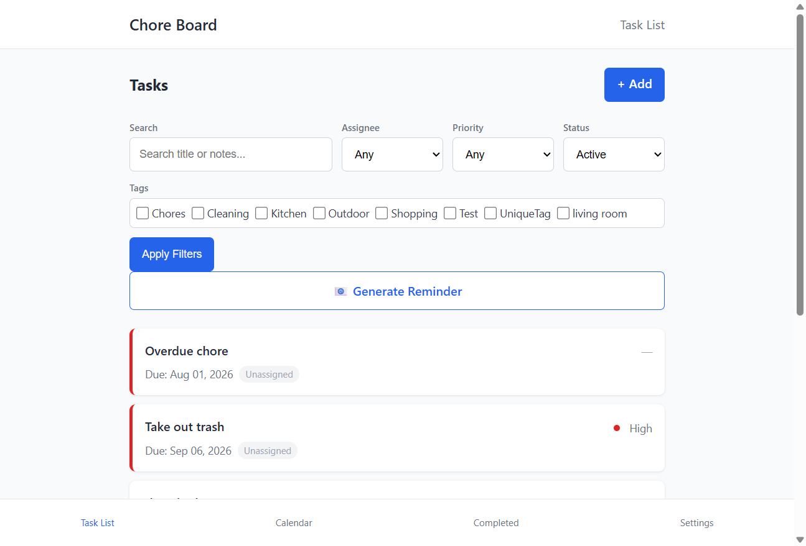
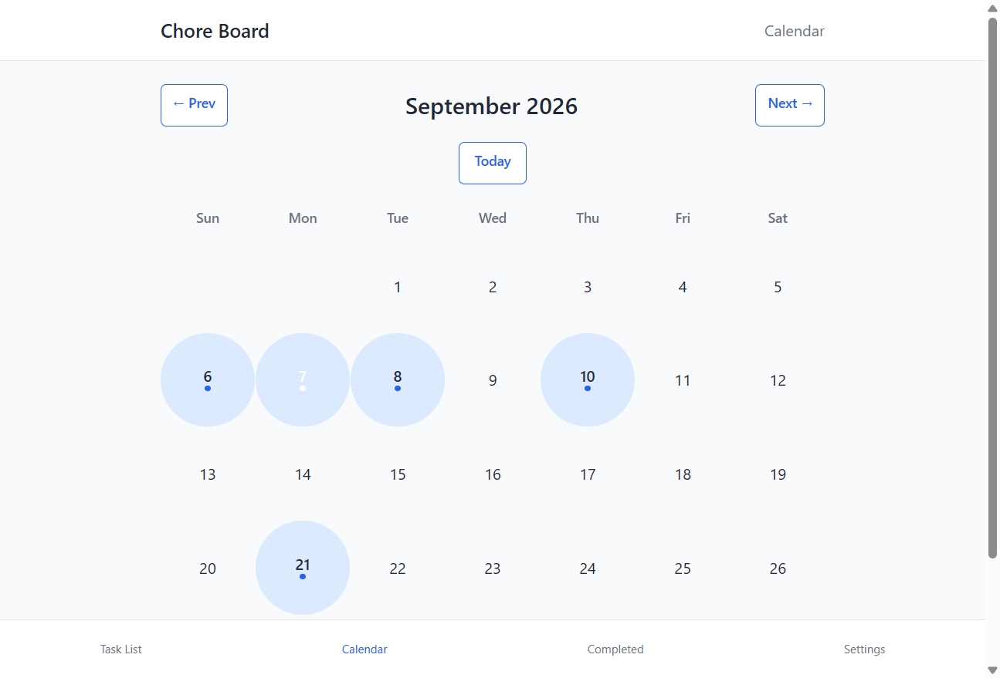

# Chore Board

A web application for managing household chores with assignees, priorities, due dates, and recurrence. It helps shared households track who needs to do what, when things are due, and which tasks are overdue — without relying on spreadsheets or group chats.

Chore Board lets you create chores, assign them to people, set priorities and due dates, and filter the list to focus on what matters. Recurring chores (daily, weekly, monthly) can automatically generate the next occurrence when completed. The calendar view shows when chores are due across the month, and the settings page lets you back up, restore, or clear all data.

## Problem

In shared living situations, keeping track of chores is surprisingly difficult:

- It is unclear who is responsible for which task
- Due dates are forgotten until something becomes overdue
- Repeating tasks (like taking out the trash) need to be tracked continuously
- Existing solutions are either too complex (full project management tools) or too simple (sticky notes with no structure)

Chore Board gives each household a shared, always-visible list with just enough structure — assignees, priorities, due dates, and tags — without requiring accounts, notifications, or external services.

## Demo

### Task list with filters



The main view shows all active chores with filtering by assignee, priority, status, and tags. Overdue chores are highlighted with a red left border. The search box filters across titles and notes in real time.

### Calendar view



The calendar view shows which days have chores due. Days with scheduled chores are marked with a blue dot, and the current day is highlighted.

## Quickstart

Prerequisites: Python 3.11+ and [uv](https://docs.astral.sh/uv/).

```bash
git clone <repository-url>
cd chore-board
uv sync --extra dev
uv run python manage.py migrate
uv run python manage.py runserver
```

Then open <http://localhost:8000/> in your browser.

## Features

### Chore management
- **Create** chores with title, due date, assignee, priority, notes, tags, and recurrence
- **View** the full task list with filtering by assignee, priority, status, and tags; search across titles and notes
- **Edit** any chore, with the option to apply changes to all occurrences in a recurring series
- **Delete** chores with a confirmation step
- **Mark complete** — non-recurring chores move to the completed list; recurring chores offer to create the next occurrence
- **Restore** completed chores back to the active list (individually or in bulk)

### Recurring chores
- Choose **daily, weekly, or monthly** recurrence when creating or editing a chore
- When marking a recurring chore complete, choose to create the next occurrence automatically
- **Skip** an occurrence to advance to the next date without completing it
- Edit a single occurrence or the entire series at once

### Calendar view
- Monthly calendar showing which days have chores due
- Navigate between months with previous/next links
- Current day is highlighted; days with chores are marked

### Settings and data
- **Export** all chores to a JSON backup file
- **Import** chores from a previously exported JSON file
- **Clear all data** with a confirmation step

### Reminder email
- Generate a pre-filled email (via `mailto:` link) listing overdue chores, chores due today, and chores due tomorrow

## How it works

### Tech stack
- **Backend:** Django 5.x with class-based views
- **Database:** SQLite (default, no external dependencies)
- **Frontend:** Django templates with vanilla JavaScript and CSS (no build step)
- **Testing:** pytest with pytest-django

### Architecture

```
Browser → Django URL router → View (class-based) → Template → HTML response
                                  ↓
                              Model (Chore, Tag)
                                  ↓
                              SQLite database
```

Requests flow through Django's URL dispatcher to class-based views, which query the `Chore` and `Tag` models and render templates. There is no API layer or JavaScript framework — the server renders full HTML pages, and small amounts of vanilla JavaScript handle filter auto-submission and date input.

### Project structure

```
chore-board/
├── choreboard/              # Django project settings
│   ├── settings.py
│   ├── urls.py
│   └── wsgi.py
├── chores/                  # Main application
│   ├── models.py            # Chore and Tag models
│   ├── views.py             # All views (list, create, detail, edit, delete, complete, calendar, settings)
│   ├── forms.py             # ChoreForm with validation
│   ├── urls.py              # URL patterns
│   ├── templates/chores/    # HTML templates
│   │   ├── base.html        # Layout with header, bottom nav
│   │   ├── task_list.html   # List view with filters
│   │   ├── task_detail.html # Single chore with actions
│   │   ├── chore_form.html  # Create/edit form
│   │   ├── calendar.html    # Monthly calendar
│   │   ├── completed.html   # Completed chores list
│   │   ├── settings.html    # Export, import, clear
│   │   └── confirm_clear.html
│   └── tests/               # Test suite
│       ├── test_overdue.py
│       ├── test_search_filters.py
│       └── test_settings.py
├── manage.py
├── pyproject.toml
└── pytest.ini
```

### Decisions and trade-offs

**SQLite over PostgreSQL or MySQL.** The application is designed for a single household, not concurrent multi-user production traffic. SQLite removes the need for a separate database service, making the project runnable with zero external dependencies. The downside is no concurrent write support — acceptable for a household tool.

**Class-based views over Django REST Framework + a JavaScript frontend.** The application is page-oriented with minimal interactivity. Server-rendered templates keep the codebase small and avoid a build step. The trade-off is full-page reloads on every action, which is fine for this use case.

**Vanilla JavaScript over a framework.** Only two interactions need client-side behavior: auto-submitting the filter form when select inputs change, and handling date input quirks. A framework would add complexity without meaningful benefit.

**No user authentication.** The app is designed to be run locally or within a trusted network. Adding authentication would complicate setup for a tool that does not store sensitive data.

## Testing

Run the full test suite:

```bash
uv run pytest
```

Run a single test file:

```bash
uv run pytest chores/tests/test_overdue.py
```

The suite includes 64 tests covering:
- Model behavior (completion, recurrence, series management)
- View responses and redirects
- Filter and search functionality
- Settings (export, import, clear data)
- Overdue highlighting logic

## Deployment

The application is designed to run locally. Start the development server:

```bash
uv run python manage.py runserver
```

Then open <http://localhost:8000/> in your browser.

For production use, you can deploy with any WSGI-compatible server (Gunicorn, uWSGI) behind a reverse proxy (Nginx, Caddy). No cloud-specific configuration is required — the app uses SQLite and has no external service dependencies.

## Limitations

- **No user authentication.** Anyone who can access the app can modify all data. Suitable for local or trusted-network use only.
- **No notifications.** Reminders require manually clicking the "Generate Reminder" link, which opens the user's email client.
- **No concurrent user support.** SQLite does not handle concurrent writes well. Multiple simultaneous edits could conflict.
- **No CI/CD pipeline.** Tests must be run manually before merging changes. To resolve this, add a GitHub Actions workflow that runs `uv run pytest` on every push and pull request.
- **Single-household scope.** There is no concept of multiple households or workspaces — all data is shared in one list.

## Future work

- Add email notifications (via a background worker or cron job) for overdue and due-soon chores
- Support multiple households with separate data spaces
- Add a dark mode toggle
- Set up CI/CD with GitHub Actions to run tests automatically
- Deploy to a hosted platform

## License

MIT
